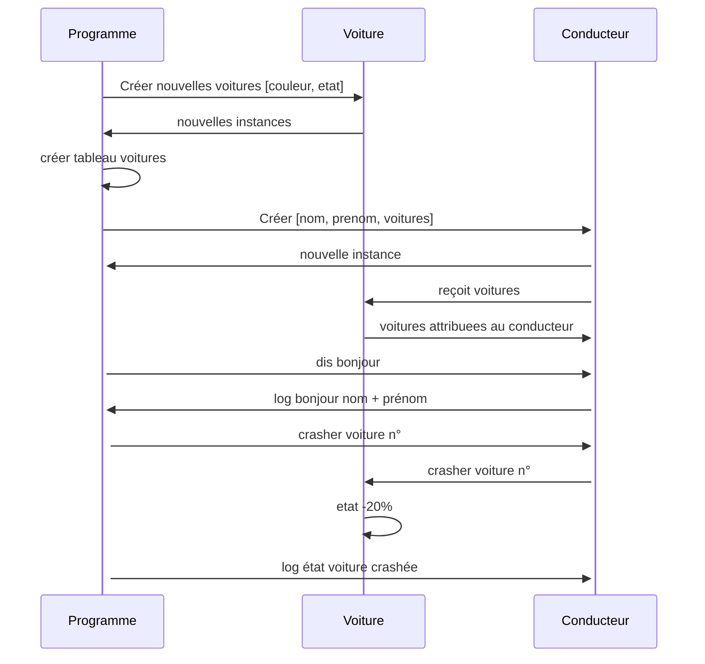

```mermaid
sequenceDiagram
    Programme->>Voiture: Créer nouvelles voitures [couleur, etat]
    Voiture->>Programme: nouvelles instances
    Programme->>Programme: créer tableau voitures
    Programme->>+Conducteur: Créer [nom, prenom, voitures]
    Conducteur->>+Programme: nouvelle instance
    Conducteur->>Voiture: reçoit voitures
    Voiture->>Conducteur: voitures attribuees au conducteur
    Programme->>+Conducteur: dis bonjour
    Conducteur->>+Programme: log bonjour nom + prénom
    Programme->>Conducteur: crasher voiture n°
    Conducteur->>Voiture: crasher voiture n°
    Voiture->>Voiture: etat -20%
    Programme->>Conducteur: log état voiture crashée
```

## Toto

1. ot
2. fdsf