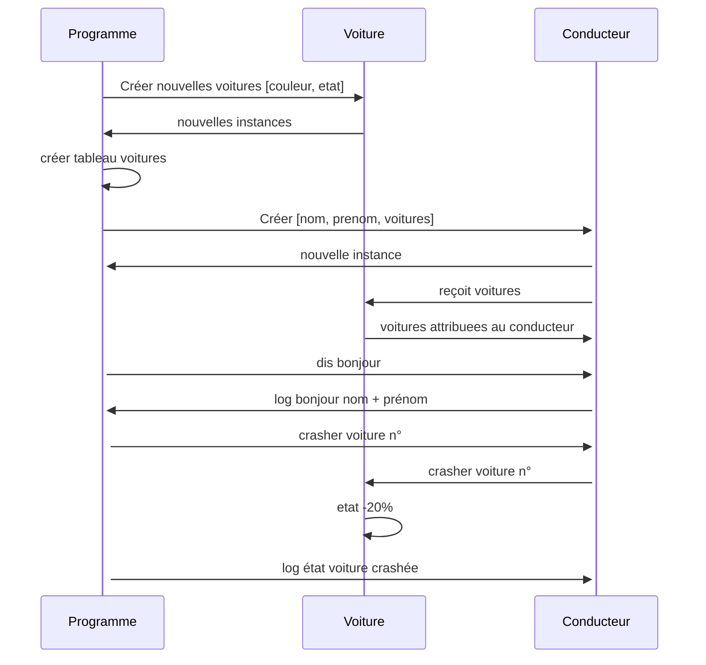

## Joueur

```mermaid
sequenceDiagram
    Programme->>+Joueur: Créer [Kevin, Durant, 37]
    Joueur->>-Programme: Nouvelle instance Joueur
    Programme->>+Joueur: Créer [Victor, Wembi, 19]
    Joueur->>-Programme: Nouvelle instance Joueur
    Programme->>+Equipe: Créer [J1, J2]
    Equipe->>-Programme: Nouvelle instance Equipe
    Programme->>+Equipe: Afficher le nombre de joueurs
    Equipe->>+Programme: nb Joueurs = 2
 ```
```mermaid
 classDiagram
    class Joueur{
      +String prenom
      +String nom
      +Int age      
    }
    class Equipe{
        +Joueur[] joueurs
        afficher nombre de joueurs()
    }
    class Match{
        +Joueur [] equipe1
        +Joueur [] equipe2
        afficher score du match()
    }
        
 ```